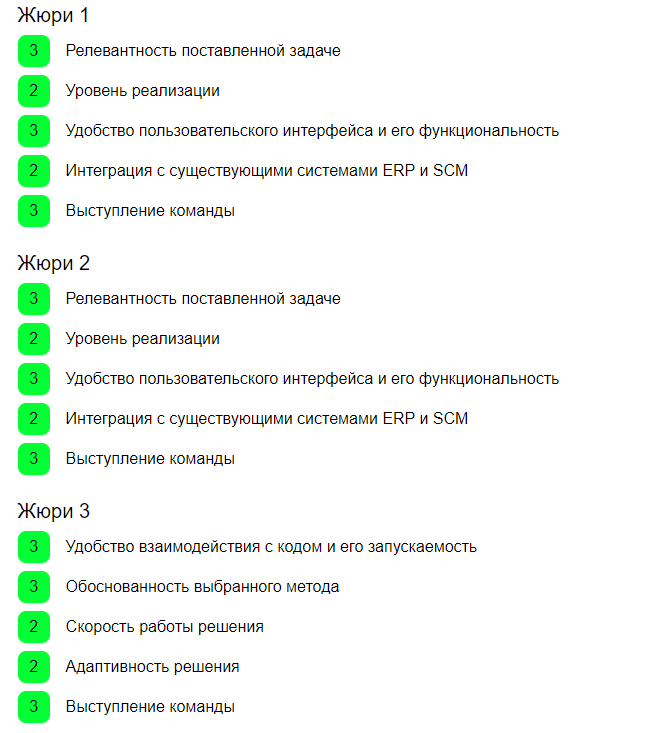
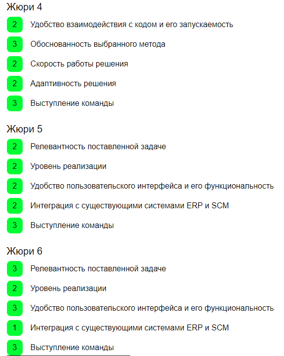
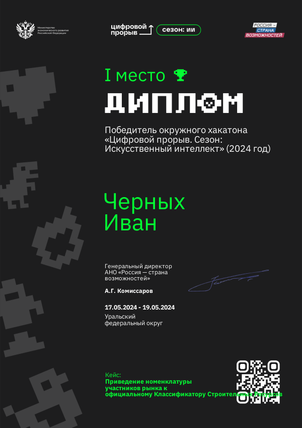

## Цифровой прорыв Окружной Хакатон 2024 (1 место)
### Кейс Приведение номенклатуры участников рынка к официальному Классификатору Строительных Ресурсов
##### Организатор: Цифровой прорыв 2024
https://hacks-ai.ru/events/1077375
##### Кейсодержатель: Аметист Кэпитал

***
### Презентация проекта
[Итоговая презентация решения на защите](https://docs.google.com/presentation/d/12XKpbRiBe5-BumJnbKVTvWVV33UTifsN/edit#slide=id.p1)

### Структура репозитария:

1. model_v2.py - итоговый модуль (класс StroyModel) модели представленной как ансамбль intfloat/multilingual-e5-small и алгоритма BM25.  
2. datasets/classification.xlsx - классификатор КСР
3. datasets/train.xlsx - обучающая выборка
4. telegram_bot.py - Телеграм-бот
5. API_main.py - API
6. requirements.txt - зависимости
7. sample_submission.csv - итоговый сабмит

###### API и Телеграм-бот используют модуль с моделью

#### Развертывание API:
- Создаем директорию для проекта mkdir ~/fastapi_project cd ~/fastapi_project 
- Создаем окружение python3 -m venv venv 
- Создаем структуру /path/to/fastapi_project ├── datasets │ ├── classification.xlsx │ ├── train.xlsx ├── model_v2.py ├── API_main.py ├── requirements.txt └── venv 
- Установим зависимости pip install -r requirements.txt 
- Стартуем сервер: uvicorn main:app --host 0.0.0.0 --port 8000 --reload

#### Развертывание Телеграм-бота:
- Устанавливаем aiogram==2.13
- Устанавливаем Токен нужного бота ( по умолчанию бот @AmethystCapitalBot) 
- Запускаем файл telegram_bot.py

### Скрикаст
[Телеграм-бот](media/bot_screencast.mp4)

### Оценки жюри

